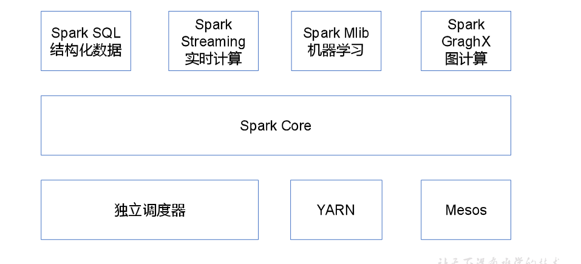

# Spark

## Spark的基本概念

**spark是一直基于内存的快速，通用，可扩展的大数据分析计算引擎**

saprk框架计算比MR快的原因是：中间不落盘，注意Spark的shuffle也是需要落盘的

RDD：弹性分布式数据集

算子：就是将问题的初始化状态通过操作进行转换为中间状态，然后通过操作转换为完成状态，中间的转换操作的英文：Operator，翻    		    译为中文就是操作，算子。

## Spark的内置模块



## Spark的特点

①快：与hadoop的MapReducer相比，Spark基于内存的运算要快100倍以上，基于硬盘的运算也要快10倍以上，Spark实现了高效的DAG执行引擎，可以通过基于内存来高效处理数据流。计算的中间结果是存在于内存中的。

②易用：Spark支持Java，Python和Scala的API

③通用：Spark提供了统一的解决方案，Saprk可以用于交互式查询（Saprk SQL）实时流处理（Saprk Streaming），机器学习（Saprk MLlib）和图计算（GraphX）

④兼容性：Spark可以非常方便地与其他的开源产品进行融合

## Spark运行模式

部署Spark集群大体上分为两种模式：单机模式和集群模式

单机模式：Local模式

集群模式：Standalone模式：Standalone模式是Spark自带的资源调度引擎，构建一个由Master+Slave构成的Spark集群，Spark运行在													集群中。

​					Yarn模式：Spark客户端直接连接Yarn，不需要额外构建Spark集群。

​					Mesos模式：Spark客户端直接连接Mesos；不需要额外构建Spark集群。

## RDD

RDD:叫弹性**分布式******数据集****，是Spark中最基本的**数据抽象**，代码中是一个抽象类，它代表一个**弹性**，**不可变**，**可分区**，里面的元素**并行计算**的集合。

### RDD的特性

①一组分区

②一个计算每个分区的函数

③RDD之间的依赖关系

④一个partition，即RDD的分片函数，控制分区数据的流向（键值对）

⑤一个列表，存储存取每个partition的优先位置，移动数据不如移动计算，除非资源不够

### RDD算子

RDD的算子分为：转换算子（transformation）和行动算子（action）,在Saprk中只有遇到action，才会执行RDD计算（即延迟计算）

### RDD的创建

在Spark中创建RDD的创建方式分为三种：从集合中创建RDD，从外部文件中创建RDD，从其他方式创建RDD。

①根据集合创建RDD

```scala
val list: List[Int] = List(1, 2, 3, 4)
// 根据集合创建RDD 方式一
val rdd: RDD[Int] = sc.parallelize(list)
// 根据集合创建RDD 方式二
val rdd2: RDD[Int] = sc.makeRDD(list)
```

②从外部存储系统的数据集中创建

```scala
// 从本地文件读取数据，来创建RDD
val rdd: RDD[String] = sc.textFile("input")
// 从hdfs上读取数据
val rdd2: RDD[String] = sc.textFile("hdfs://hadoop104:8020/input")
```

③通过RDD的转换算子转换

## 第一个Spark代码

### pom.xml文件

```xml
<?xml version="1.0" encoding="UTF-8"?>
<project xmlns="http://maven.apache.org/POM/4.0.0"
         xmlns:xsi="http://www.w3.org/2001/XMLSchema-instance"
         xsi:schemaLocation="http://maven.apache.org/POM/4.0.0 http://maven.apache.org/xsd/maven-4.0.0.xsd">
    <modelVersion>4.0.0</modelVersion>

    <groupId>org.example</groupId>
    <artifactId>Spark</artifactId>
    <packaging>pom</packaging>
    <version>1.0-SNAPSHOT</version>

    <properties>
        <maven.compiler.source>8</maven.compiler.source>
        <maven.compiler.target>8</maven.compiler.target>
    </properties>

    <dependencies>
        <dependency>
            <groupId>org.apache.spark</groupId>
            <artifactId>spark-core_2.11</artifactId>
            <version>2.1.1</version>
        </dependency>
        <dependency>
            <groupId>mysql</groupId>
            <artifactId>mysql-connector-java</artifactId>
            <version>5.1.47</version>
        </dependency>
        <dependency>
            <groupId>org.apache.spark</groupId>
            <artifactId>spark-sql_2.11</artifactId>
            <version>2.1.1</version>
        </dependency>

        <dependency>
            <groupId>org.apache.spark</groupId>
            <artifactId>spark-streaming_2.11</artifactId>
            <version>2.1.1</version>
        </dependency>

        <dependency>
            <groupId>org.apache.spark</groupId>
            <artifactId>spark-streaming-kafka-0-8_2.11</artifactId>
            <version>2.1.1</version>
        </dependency>


    </dependencies>

    <build>
        <finalName>WordCount</finalName>
        <plugins>
            <plugin>
                <groupId>net.alchim31.maven</groupId>
                <artifactId>scala-maven-plugin</artifactId>
                <version>3.4.6</version>
                <executions>
                    <execution>
                        <goals>
                            <goal>compile</goal>
                            <goal>testCompile</goal>
                        </goals>
                    </execution>
                </executions>
            </plugin>

            <plugin>
                <groupId>org.apache.maven.plugins</groupId>
                <artifactId>maven-assembly-plugin</artifactId>
                <version>3.0.0</version>
                <configuration>
                    <archive>
                        <manifest>
                            <mainClass>com.yue.spark.WordCount</mainClass>
                        </manifest>
                    </archive>
                    <descriptorRefs>
                        <descriptorRef>jar-with-dependencies</descriptorRef>
                    </descriptorRefs>
                </configuration>
                <executions>
                    <execution>
                        <id>make-assembly</id>
                        <phase>package</phase>
                        <goals>
                            <goal>single</goal>
                        </goals>
                    </execution>
                </executions>
            </plugin>

        </plugins>
    </build>

</project>
```

### WordCount案例

```scala
package com.yue.spark

import org.apache.spark.{SparkConf, SparkContext}

/**
 * TODO
 *  第一个wordcount案例
 *
 * @author 岳昌宏
 * @date 2021/7/27 16:49
 */
object WordCount {
    def main(args: Array[String]):Unit = {
        // 创建SparkConf配置文件
        val conf:SparkConf = new SparkConf().setMaster("local[*]").setAppName("WordCount")

        // 创建SparkContext对象
        val sc:SparkContext = new SparkContext(conf)


        sc.textFile(args(0))
            .flatMap(_.split(" ")).map((_, 1)).reduceByKey(_+_).saveAsTextFile(args(1))

        // 关闭连接
        sc.stop()
    }

}
```

## 创建RDD的默认分区规则

### 从集合中创建RDD

从集合中创建RDD取于分配给应用的CPU核数

`val conf: SparkConf = new SparkConf().setAppName("Spark03_Partition_default").setMaster("local[*]")`

### 读取外部文件创建RDD

读取外部文件创建RDD，取决于分配给应用的CPU核数和2取最小值。

在textFile方法中的第二个参数minPartitions表示最小分区数，是最小，不是实际的分区个数，在实际计算分区个数的时候，会根据文件的总大小个最小分区数进行相除运算，如果余数为0，那么最小分区数就是最终实际的分区个数；如果余数不为0，实际分区个数要经过计算才能得到。

## 转换算子

### Value类型

#### map

**rdd.map(f:Int=>U)**

参数f是一个函数，它可以接受一个参数，当某个rdd执行map方法时，会遍历该rdd中的每一个数据项，并依次应用f函数，从而参数一个新的rdd，即这个新的rdd中的每一个元素都是原来rdd中每一个元素依次应用f函数而得到的（分区不变，数据类型可能改变）

```scala
import org.apache.spark.rdd.RDD
import org.apache.spark.{SparkConf, SparkContext}


/**
 * TODO
 *
 * @author 岳昌宏
 * @date 2021/8/16 19:46
 */
object Text {
    def main(args : Array[String]) : Unit = {
        val conf: SparkConf = new SparkConf().setAppName("Text").setMaster("local[*]")
        val sc = new SparkContext(conf)

        val listRDD: RDD[Int] = sc.parallelize(List(1, 2, 3, 4, 5))

        val resRDD: RDD[Int] = listRDD.map(_ + 1) // 使集合中的每一个元素都加1

        resRDD.collect().foreach(println)

        sc.stop()
    }
}
```

#### mapPartitions

**rdd.mapPartitions(f:Iterator[U]=>Iterator[U])**

以分区为单位执行map，Map是一次处理一个元素，mapPartitions()是一次处理一个分区的数据

```scala
import org.apache.spark.rdd.RDD
import org.apache.spark.{SparkConf, SparkContext}


/**
 * TODO
 *
 * @author 岳昌宏
 * @date 2021/8/16 19:46
 */
object Text {
    def main(args : Array[String]) : Unit = {
        val conf: SparkConf = new SparkConf().setAppName("Text").setMaster("local[*]")
        val sc = new SparkContext(conf)

        val listRDD: RDD[Int] = sc.parallelize(List(1, 2, 3, 4, 5))

        val resRDD: RDD[Int] = listRDD.mapPartitions(_.map(_+1)) // 使集合中的每一个元素都加1，注意：这里的map是方法不是算子

        resRDD.collect().foreach(println)

        sc.stop()
    }
}
```

注意：Iterator用完即丢，并且会持续更新迭代器的状态

```scala
import org.apache.spark.rdd.RDD
import org.apache.spark.{SparkConf, SparkContext}


/**
 * TODO
 *
 * @author 岳昌宏
 * @date 2021/8/16 19:46
 */
object Text {
    def main(args : Array[String]) : Unit = {
        val conf: SparkConf = new SparkConf().setAppName("Text").setMaster("local[*]")
        val sc = new SparkContext(conf)

        val listRDD: RDD[Int] = sc.parallelize(List(1, 2, 3, 4, 5))

        val resRDD: RDD[Int] = listRDD.mapPartitions(it => {
            it.foreach(_+1) // foreach()返回值是void，map的返回值是Iterator，而且Iterator数据用完即丢
            println(">>>" + it.toString()) // // 此时迭代器中无数据
            it
        })

        resRDD.collect().foreach(println) // 注意是没有输出结果的

        sc.stop()
    }
}
```

>>>empty iterator
>>>empty iterator
>>>empty iterator
>>>empty iterator
>>>empty iterator
>>>empty iterator
>>>empty iterator
>>>empty iterator

Process finished with exit code 0

#### map和mapPartitions的区别

map():每次处理一条数据，mapPartitions()每次处理一个分区的数据，这个分区的数据处理完后，原RDD中分区的数据才能释放，可能导致OOM。开发经验：当内存空间较大的时建议使用mapPartitions以提高效率。

#### mapPartitionsWithIndex

**rdd.mapPartitionsWithIndex(f:(Int,Iterator[U])=>Iterator[U])**

类似mapPartitions比mapPartitions多了一个分区的编号，可以单独对某一个分区做特殊的操作

